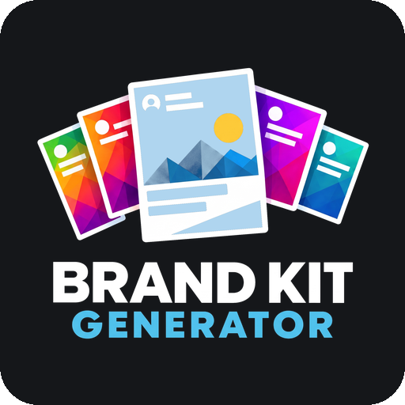

# What this tool does



The Brand Kit Generator produces **transparent PNG overlays for social media**. An overlay is the graphic that sits on top of a video or a still. Its layout comes entirely from the template — the ones that ship show a few possibilities, a template of your own can be arranged completely differently.

What comes out is a PNG file with a transparent background. It goes into any video editor, streaming program or image editor and sits as the topmost layer over your material. Put a background image under the overlay and that image is exported with it — the file is then finished and ready to upload. The generator does not edit and does not render video — it delivers the graphic.

## The five building blocks

A finished overlay comes from five things, each chosen independently:

| Block | What it holds |
| --- | --- |
| **Product** | Title, slogan and logo of a brand or show |
| **Template** | The layout — an HTML file whose CSS carries the entire design |
| **Colour set** | Seven colour roles and their assignment to design objects |
| **Font set** | Named font variations and which one each placeholder uses |
| **Content** | Title, subtitle, description and up to two tags of this particular post |

The five are combined and rendered in one of four output formats:

```
product + template + colour set + font set + content  →  PNG
```

That is the point of it: every block can be swapped on its own. A different colour set changes the colour without touching the layout. A different template changes the layout without retyping the text.

## The four formats

| Format | Size | Name |
| --- | --- | --- |
| **1:1** | 1080 × 1080 px | Square |
| **9:16** | 1080 × 1920 px | Vertical |
| **16:9** | 1920 × 1080 px | Landscape |
| **4:5** | 1080 × 1350 px | Portrait |

The same template works in all four. It knows which one it is being rendered in and adapts its layout — in a lower third the type grows in the narrow format, because the post is shown smaller in the feed.

## What you need

**A browser:** Chrome or Edge. The PNG export is verified there. In Safari it is not reliable.

**A web server:** The application runs in the browser but has to be opened over `http://`, not by double-clicking the file.

> [!IMPORTANT] Double-clicking does not work
> Opened straight from the file manager, `index.html` cannot load its template files — the browser refuses. The preview then stays empty and reports an error. How to start the application properly is in the next chapter.

**Nothing else.** There is no installation, no build, no account and no server application. Fonts and libraries ship with the project; after the first load everything works offline.

## Language

The interface speaks English and German. It follows what your browser reports and falls back to English. The **DE / EN** button in the top right switches between them at any time; the button shows the language it would switch to.

The switch changes the interface only. Your own names for products, colour sets and font sets stay exactly as you typed them.

## Where your data lives

Everything you set up — company, products, colour sets, font sets, text — stays **in your browser**. Nothing is transmitted, there is no server storing anything.

That has a flip side: clearing your browser data takes your setup with it. How to make a backup is in the chapter *Saving and moving*.
